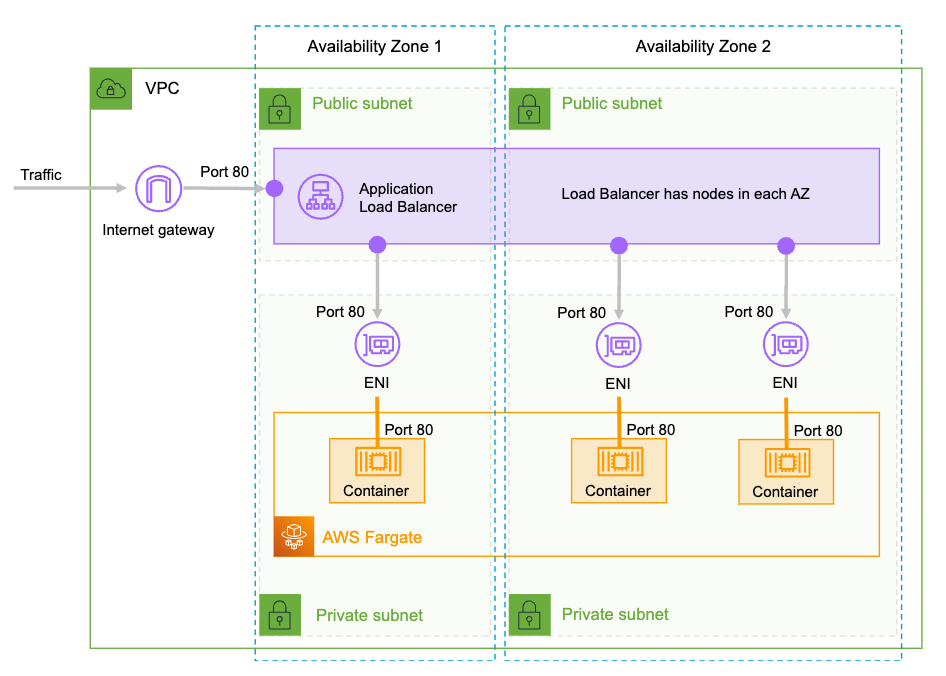

# Terraform AWS ECS Hello Service - Fargate Deployment

## Architecture Diagram



## Overview

This Terraform script deploys a stateless web application as an AWS ECS service using AWS Fargate. The web application is hosted behind an Application Load Balancer (ALB) in a public subnet.

## Prerequisites

Before running this Terraform script, ensure you have:

1. An AWS account with appropriate permissions.
2. Terraform installed on your local machine.
3. AWS CLI installed and configured with valid credentials.

## Configuration

### Inputs

The following input variables can be configured in `terraform.tfvars` or as environment variables:

- `aws_region` (string): The AWS region where the resources will be created. Default: "us-east-1".

### Outputs

The following output values are displayed after the deployment:

- `web_app_url` (string): The DNS name of the Application Load Balancer (ALB) that routes traffic to the deployed web application.

## Deployment Steps

1. Clone this repository to your local machine.

2. Create a `terraform.tfvars` file with your desired values or export the variables as environment variables.

3. Initialize the Terraform workspace:

   ```bash
   terraform init

4. Review the execution plan:

   ```bash
   terraform plan

5. Deploy the infrastructure:

   ```bash
   terraform apply

6. After deployment, the *'web_app_url'* output will display the DNS name of the ALB. Access the web application using this URL.

7. To destroy the infrastructure, run:

   ```bash
   terraform destroy
